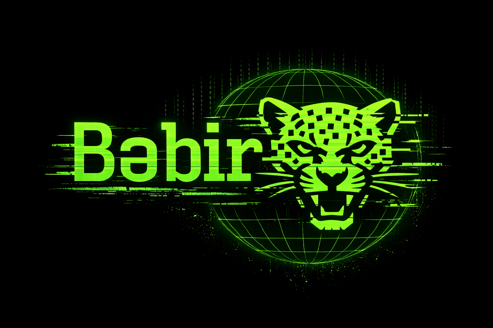

<div align="center">
  
</div>

---

```
bəbir — language learning toolkit
parse course materials → build knowledge base → generate exercises → export pdf
```

---

## what it does

reads `.docx`/`.pdf` course files, extracts vocabulary and grammar into a local
knowledge base, then generates printable exercise sheets from that knowledge.

```
source_data/          ← your course files go here
knowledge/            ← extracted vocab + grammar (json)
exercise_data/        ← exercise descriptions + generated output
```

---

## run it

**1. extract knowledge from course files**
```bash
python scripts/process_files.py
# generates chunks from source files in source_data/chunks/
# feed the chunks to an AI agent using exercise_data/extraction_agent.md
```

**2. build exercise descriptions**
```bash
python scripts/create_exercises.py
# interactive CLI — pick types, tags, optional spec
# writes exercise_data/outputs/exercises_description.ex
```

**3. generate exercise content**
```bash
...
# feed exercise_data/outputs/exercises_description.ex
# to an AI agent following exercise_data/exercise_generation_agent.md
# → writes exercise_data/outputs/exercises.ex
```

**4. export to pdf**
```bash
python scripts/generate_pdf.py
# reads  exercise_data/outputs/exercises.ex
# writes exercise_data/outputs/exercises.pdf
```

---

```
deps: reportlab  
fonts: dejavu sans mono (bundled)
python 3.11+
```
